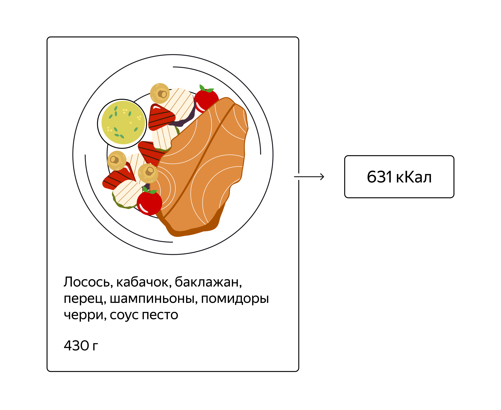
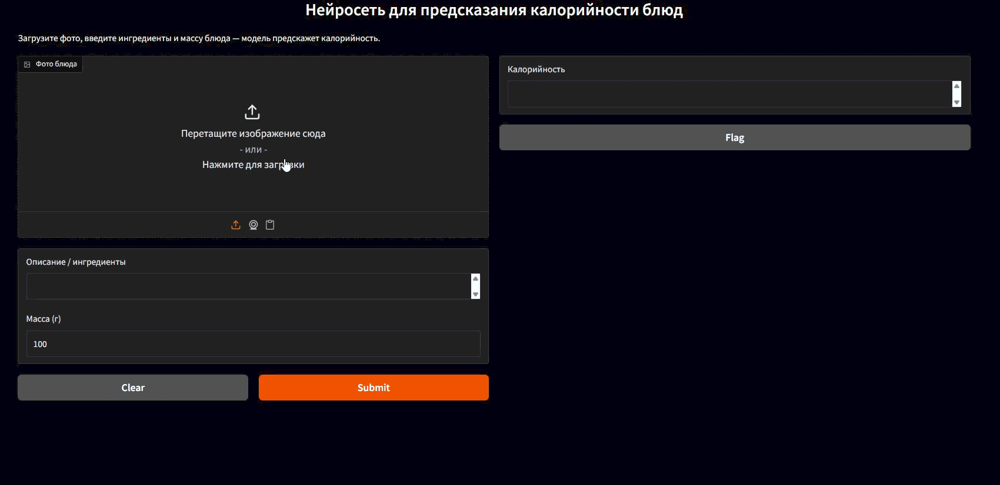
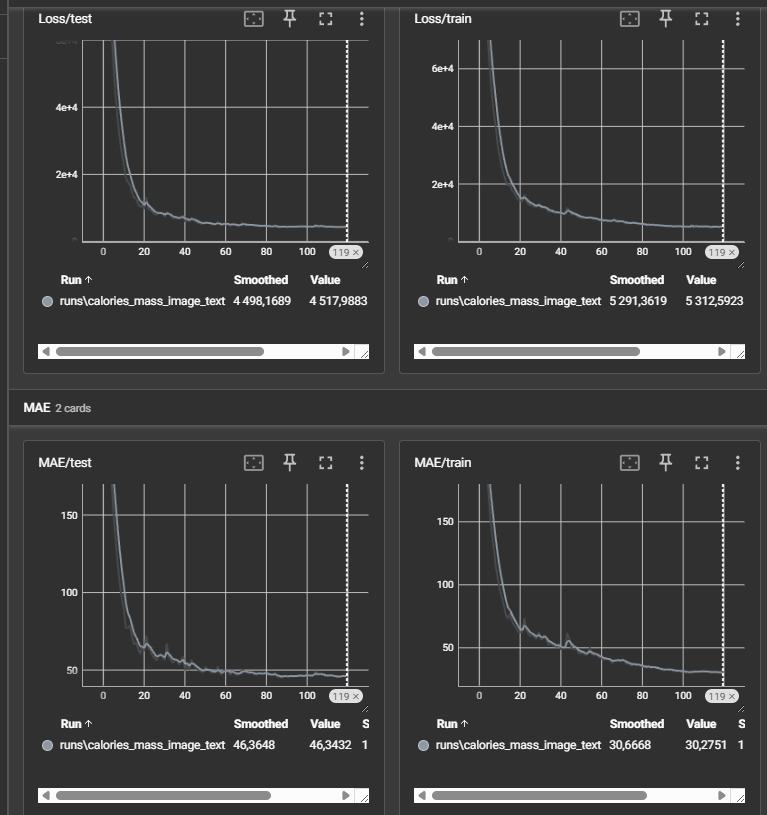

# Предсказание калорий по изображению и ингредиентам

**Запуск демо:** `python gradio.py` (после установки зависимостей и наличия весов `best_model.pth`).





## Установка

Создайте виртуальное окружение и установите зависимости:

```bash
python -m venv .venv
# Windows:
.venv\Scripts\activate
# Linux / macOS:
source .venv/bin/activate

pip install -U pip
pip install -r requirements.txt
```

## Данные

Проект использует набор блюд с праймером по массе, изображению и списку ингредиентов.

- `dataset/data/dish.csv` — основной датафрейм с калориями, массой, идентификатором блюда, разбиением на сплиты.
- `dataset/data/ingredients.csv` — расшифровка ингредиентов.
- `dataset/data/images/` — директории `dish_id/rgb.png` с изображениями.

Если исходные данные отсутствуют, их можно скачать по ссылке из обучающего курса Яндекс.Практикума и распаковать в каталог `dataset/data` согласно структуре выше.

### Шаг 1. Предобработка (см. `solution.ipynb`, раздел «Шаг 1»)

1. Читаем `dataset/data/dish.csv` и `dataset/data/ingredients.csv`.
2. Преобразуем id ингредиентов в названия (`ids_to_names`).
3. Собираем текстовый признак `ingredients_text`, очищаем и, при необходимости, перемешиваем порядок ингредиентов.
4. Разделяем данные на `train/test` по колонке `split`.
5. Токенизируем тексты BERT-токенайзером (`google/bert_uncased_L-2_H-128_A-2`).
6. Сохраняем итоговые сплиты в артефакты ноутбука (см. `solution.ipynb`).

## Шаг 2. Обучение (см. `solution.ipynb`, раздел «Шаг 2»)

- Модель: `model.py → CaloriesModel` (визуальный бэкбон EfficientNet Lite0 + текстовый энкодер BERT + масса блюда).
- Датасет: `dataset.py → CaloriesDataset` (картинка + текст + масса, возможно перемешивание текста для аугментации).
- Тренировочный скрипт: `train.py`.
- Лоссы и метрики (`Loss`, `MAE`) пишутся в TensorBoard по пути `runs/calories_mass_image_text`.
- Лучшие веса сохраняются в `best_model.pth`.

Пример запуска обучения:

```bash
python - <<'PY'
import torch
from config import Config
from train import train

device = torch.device('cuda' if torch.cuda.is_available() else 'cpu')
train(Config, device)
PY
```

Для отслеживания обучения в TensorBoard:

```bash
tensorboard --logdir runs/calories_mass_image_text
```



## Шаг 3. Оценка и сравнение (см. `solution.ipynb`, раздел «Шаг 3»)

- Скрипт `validate.py` загружает веса и считает MAE на тестовой выборке.
- Результаты по каждому блюду сохраняются в список, где указывается предсказание, таргет, масса, ингредиенты и путь до исходного изображения.

Пример запуска в терминале:

```bash
python - <<'PY'
import torch
from config import Config
from validate import validate

device = torch.device('cuda' if torch.cuda.is_available() else 'cpu')
results, mae = validate(Config, device, Config.SAVE_PATH)
print(f'MAE on test: {mae:.3f}')
print(f'Samples: {results[:3]}')
PY
```

## Структура проекта

```
├── config.py           # Глобальные гиперпараметры, пути к данным, чекпойнт
├── dataset.py          # Класс CaloriesDataset + collate_fn
├── model.py            # Архитектура CaloriesModel (изображение + текст + масса)
├── train.py            # Скрипт обучения, логи в TensorBoard, сохранение best_model.pth
├── validate.py         # Оценка модели на тесте, расчёт MAE
├── gradio.py           # Заготовка демо на Gradio для inference
├── requirements.txt    # Зависимости проекта
├── solution.ipynb      # Исследовательский ноутбук с полным пайплайном
└── dataset/
    └── data/
        ├── dish.csv
        ├── ingredients.csv
        └── images/
```

## Что делает `CaloriesDataset`

- Собирает из датафрейма массы, калории, путь к изображению и текст ингредиентов.
- Применяет аугментации и нормализацию из `timm`-конфига.
- Возвращает словарь: `total_calories`, `total_mass`, `image`, `input_ids`, `attention_mask`, `ingredients_text`.

## Что делает `CaloriesModel`

- Извлекает визуальные признаки через EfficientNet Lite0 (timm, `features_only=True`).
- Усредняет spatial map, проецирует в эмбеддинг.
- Кодирует ингредиенты через лёгкий BERT, усредняет токены, проецирует в текстовый эмбеддинг.
- Конкатенирует эмбеддинги с массой блюда и подаёт в регрессионную голову для предсказания калорий.

## Логи и результаты обучения (TensorBoard)

- `Loss/train` и `Loss/test` стабильно снижаются и расходятся минимально — переобучения не наблюдается.
- `MAE/train` и `MAE/test` монотонно падают; финальное MAE на тесте смотрите в логе и консоли.
- Планировщик `CosineAnnealingLR` позволяет модели дообучиться на сниженной скорости обучения, что видно по дополнительному улучшению метрик на поздних эпохах.

В сумме: мультимодальная модель (изображение + текст + масса) устойчиво обучается, даёт стабильное снижение MAE и готова для инференса через Gradio-демо.
